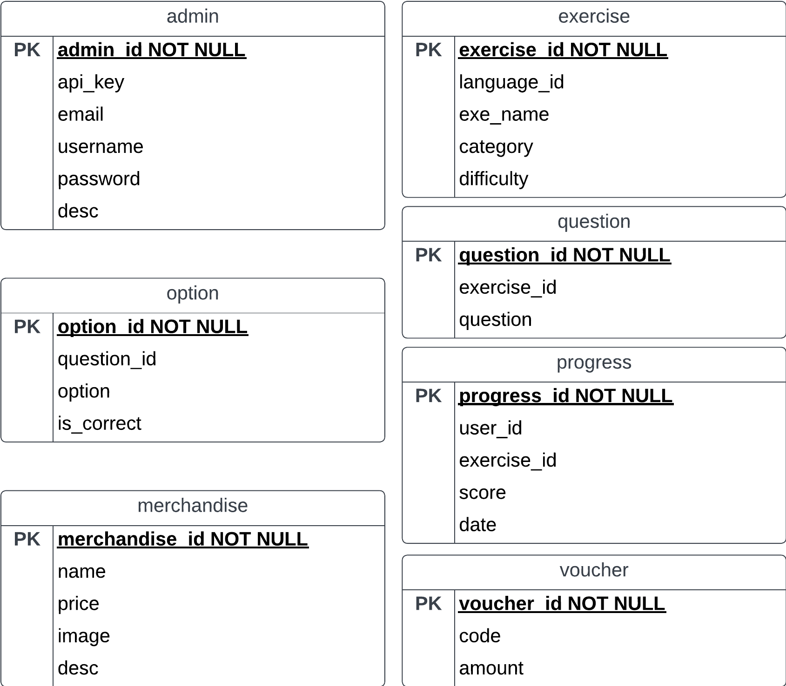

# Soap Service for Toco

## Introduction
Toco-rest is a rest service for Toco. It is a simple service that allows toco to communicate with other systems using rest. it is built using express and postgres for the database . This service is built to complete IF3110 assignment.

## Features Overview
  - [x] manage exrcise
  - [x] manage merchandise
  - [x] manage voucher

## Installation
there are 2 ways that you can run this server

1. using docker
- make sure you have docker installed
- run `docker compose build`
- run `docker compose up`
- the server will run on port 5000

## Database Schema
Toco soap service uses 7 tables in the database, the tables are `admin`, `exercise`, `question`, `option`, `progress`, `merchandise`, and `voucher` . The schema for the tables are as follows

## Endpoints

